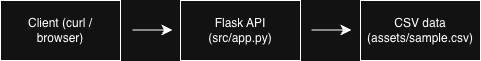

# Final Project for Systems - Flask + Docker API

## Executive Summary

**Problem:** Data scientists and developers need quick, reproducible ways to serve small datasets via REST APIs for testing data pipelines, prototyping applications, or sharing data with team members without complex database setup.

**Solution:** This project exposes a small CSV dataset over HTTP using a Flask application running inside a Docker container. It shows environment-based configuration, containerization, and a simple data-serving endpoint.

## System Overview

### Course Concept(s)
This project demonstrates concepts from **Module 3: Web APIs and Containerization**:
- RESTful API design with Flask framework and HTTP methods
- Containerization with Docker for reproducible, portable deployments
- Environment-based configuration management using environment variables
- Data serving patterns with query parameter filtering
- Health check endpoints for monitoring and orchestration

### Architecture Diagram


### Data/Models/Services
- **Data Source:** `assets/sample.csv` 
- **Size:** 4 records, ~150 bytes
- **Format:** CSV with columns: id, name, genre
- **License:** Sample data created for this project (no external dependencies or licensing requirements)
- **Framework:** Flask 3.0+ (MIT License)
- **Runtime:** Python 3.11 in Docker container

### System Components
- Framework: Flask
- Data source: assets/sample.csv (loaded into memory on startup)
- Endpoints:
  - GET /health -> returns {"status":"ok"}
  - GET /records -> returns all rows
  - GET /records?genre=pop -> filtered rows (example query param)
- Port: 5055
- Config: DATA_PATH environment variable

## Project Structure
```
.
├── src/            # Flask app
│   └── app.py
├── assets/         # sample data
│   └── sample.csv
│   └── architecture.png
├── tests/          # smoke test
│   └── smoke.sh
├── Dockerfile
├── requirements.txt
├── .env.example
├── LICENSE
└── README.md
```

## How to Run (Local)

### Docker
```bash
docker build -t myapp .

docker run --rm -p 5055:5055 --env-file .env.example myapp
```

In another terminal:
```bash
curl http://localhost:5055/health
curl http://localhost:5055/records
curl "http://localhost:5055/records?genre=pop"
```

## Design Decisions

### Why This Concept?
**Flask for minimal REST API:** Flask was chosen for its simplicity and minimal boilerplate, making it ideal for lightweight data-serving applications. Alternative frameworks like FastAPI offer async capabilities and auto-generated docs, but Flask's simplicity was sufficient for this use case.

**In-memory CSV loading:** Data is loaded into memory on startup to avoid database setup complexity. This is acceptable for small datasets (< 100MB) and provides fast read access. For larger datasets or write operations, a database like PostgreSQL or MongoDB would be necessary.

**Docker containerization:** Ensures the application runs identically across development, testing, and production environments. Alternative approaches like virtual environments or direct deployment lack the isolation and reproducibility that containers provide.

### Tradeoffs
- **Performance:** In-memory data provides fast reads but limits scalability to datasets that fit in RAM. No write persistence between container restarts.
- **Cost:** Single container deployment is cost-effective for development but would need orchestration (Kubernetes, ECS) for production scaling.
- **Complexity:** Minimal dependencies and simple architecture make the codebase easy to understand and maintain, at the cost of advanced features.
- **Maintainability:** Environment-based configuration and clear separation of concerns (app logic, data, tests) make the project easy to modify and extend.

### Technical Decisions
- Used Flask for a minimal REST-style API.
- Loaded CSV into memory to avoid database setup.
- Used environment variables (.env.example) so paths are not hardcoded.
- Packaged as a single container for reproducible runs.

### Security/Privacy
- No secrets are committed; configuration uses environment variables (.env.example).
- Input validation on query parameters to prevent injection attacks.
- Sample data contains no personally identifiable information.
- Container security: Base Python image is from official Docker Hub; dependencies are pinned in requirements.txt.

### Ops
- Container logs to stdout, so it can be monitored easily when deployed.
- Stateless design allows horizontal scaling behind a load balancer.
- **Known limitations:** 
  - No data persistence (in-memory only)
  - No authentication/authorization
  - Limited to single-node deployment without orchestration
  - No rate limiting

## Results & Evaluation

### Sample Responses
```bash
$ curl http://localhost:5055/health
{"status":"ok"}

$ curl http://localhost:5055/records
[{"genre":"pop","id":"1","name":"Song A"}, {"genre":"rock","id":"2","name":"Song B"}, {"genre":"pop","id":"3","name":"Song C"}, {"genre":"jazz","id":"4","name":"Song D"}]

$ curl "http://localhost:5055/records?genre=pop"
[{"genre":"pop","id":"1","name":"Song A"}, {"genre":"pop","id":"3","name":"Song C"}]
```

### Validation
The service responds to health checks and returns filtered data from the CSV.

- GET /health → 200 OK with {"status":"ok"}
- GET /records → returns all 4 demo rows
- GET /records?genre=pop → returns only rows with genre=pop

This demonstrates the container is healthy and the API can filter data.

### Tests
Start the container (see "How to Run"), then in another terminal:
```bash
./tests/smoke.sh
```

### Performance Notes
- **Startup time:** < 2 seconds from `docker run` to accepting requests
- **Response time:** < 10ms for health check, < 50ms for data endpoints
- **Resource footprint:** ~50MB container image, ~30MB RAM at runtime

```

## What's Next

### Planned Improvements
- **Database integration:** Add PostgreSQL or MongoDB backend for persistent storage instead of in-memory CSV
- **Authentication:** Implement JWT token-based authentication for secure API access
- **Enhanced querying:** Add pagination, sorting, and multi-field filtering capabilities
- **API documentation:** Create Swagger/OpenAPI specification with interactive docs
- **Production deployment:** Deploy to AWS ECS, Google Cloud Run, or Azure Container Instances
- **Observability:** Add Prometheus metrics endpoint and structured logging with correlation IDs
- **Rate limiting:** Implement rate limiting using Flask-Limiter to prevent API abuse
- **CI/CD pipeline:** Add GitHub Actions for automated testing and container registry pushes

## Links
- **GitHub Repository:** https://github.com/kavanwills/ds-systems-final
- **Docker Hub:** (optional - add if you push to Docker Hub)
- **Live Demo:** (optional - add if you deploy to cloud)

---

## License
This project is licensed under the MIT License - see the LICENSE file for details.
